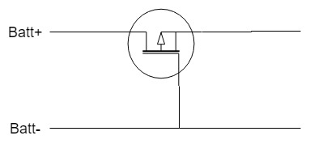
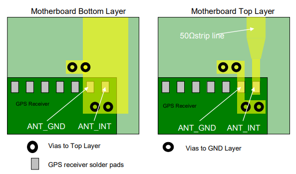
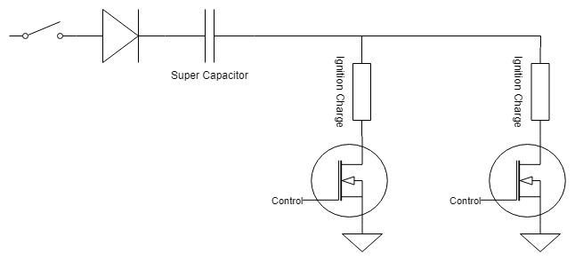

# Printed Circuit Board

*Figure 1: KiCad rendering of front of the redesigned PCB*

## Features

### Power Control
+ An SMD voltage regulator was chosen to save on space as the previous one was too tall
+ A reservoir capacitor is used to reduce brown out risk
+ A P-type MOSFET is used to ensure the battery is plugged in the correct way
+ Ferrite beads are used on the high frequency components (GPS, RF Module) to reduce any high frequency interference in the power plane interfering with components

An important thing to consider for the voltage regulator is that at higher altitudes the air is less dense and so heat sinks will be les effective.
Because of this the voltage regulator used needs to be capable of exceeding regulation requirements so that it will not overheat at higher altitudes.

Originally a diode was used for reverse polarity protection on the battery.
However due to the large current draw of the servos the diode would be dissipating roughly 1.4 Watts which is not only a waste of power but a large amount of heat generated.
Instead a P-type MOSFET is used wired up the in the configuration below.
When selecting the MOSFET for this application the most important characteristic is the Drain-Source voltage if this is lower than the voltage of the battery the configuration will not work.

No devices require 5V therefore a 3.3V regulator will be used wired directly to the 3.3V pin.
The servos require more power than most voltage regulators can supply and when tested they often caused the voltage regulator to fail entirely.
To prevent this they are supplied directly from the battery and not through the regulator.

### Teensy 3.6
+ Headers used to attach Teensy to board.
+ 3.6 model used as it has improved processing power and built in SD card reader over Teensy 3.2 of previous years

The SD card writer can be unreliable in it's write times especially as the SD card fills up, this can be a big waste of time and slow the control system down.
It was considered to trim the edges of the Teensy to castelate the holes so that it could be surface mounted to the board.
This was deemed unwise as long surface mounted components can come undone when the PCB flexes such as under the strain of launch.

### GPS
+ very specific traces for antenna must be 50ohm
+ uses a single helical antenna via SMA connector.
+ UART connection

Patch antennas such as the one used in previous years are very directional, this is a problem in a device which could land in any orientation.
There are very few omnidirectional antennas, the best being Helical antennas which can be bulky and heavy if they include a ceramic core.
Alternatively chip antennas can be used, the downside of which is much lower gain.
The biggest problem when including any antenna is that the sensitivity is very dependent on the ground plane it is surrounded by.
This is a problem as the avionics package has very limited space an providing dedicated space for the antenna is not likey to be practical.

The antenna used currently is a helical antenna which has a very omnidirectional radiation pattern.
It is connected by a SMA connector, shielded by a grounded loop.
The two main benefits of using an SMA connector is that it allows the antenna to be swapped out if need be and by using a small wire the antenna can be placed further away from the PCB for better reception.

The connection to the chip is a quite specific and stated in the user manual of the GPC chip.

The previous version of the board used two patch antennas on either side of the board and a switch to switch between them very rapidly to get a lock.
When tested this took a long time to get a lock but was fairly good at maintaining it.

### IMU
+ QFN packages could be used
+ Connected to Teensy by SPI

The MPU-9250 IMU is used, two in QFN package and one using the SprakFun breakout board.
There were concerns initially for getting a PCB manufactured with fine enough pitching for the QFN packages but JLCPCB offers such a service without the increased cost of PCBway.
The next problem with the QFN packages is soldering them to the board, becuase the pads are on the bottom of the package they are troublesome to solder by hand.
If they cannot be soldered by hand there is a footprint on the board for a SparkFun breakout to act as a replacement.

Note: the Sparkfun breakout shares the chip select with one of the QFN packages and therefore cannot both be used at the same time.

Because of the acceleration experienced by package, sensor fusion cannot reliably be used and the gyroscope is used.
The gyroscope drift was measured and was found to be very small within the 2-3 seconds of burn time that it is needed.

### Radio
+ Connected over the same SPI connection as IMU
+ uses LoRa modulation
+ has wire antenna

LoRa modulation was used over other, open source, modulation techniques despite the extra cost simply due to the low power consumption and unrivalled range.
The downside of LoRa is that it is a proprietary modulation which means that both the package and base station need to be LoRa chips.
If a different modulation was used any RF transciever could be used for the base station and demodulation done on the computer.

The previous revision of the board used the RFM9x with a breakout board making it breadboard compatible and adding a buffer for compatibility with 5V logic.

The new revision does not require the breakout board meaning the module can be soldered directly to the board, saving space.

### Servos
The servos use a standard connector that is compatible with JST connectors or standard headers.
They also have pull down resistors on the control line.

### Ignition System
+ N-FET transistors are used to handle the current needed for ignition (~1A)
+ Six igniters are needed, launch, primary chute, secondary chute and a backup for each

Details regarding the ignition system can be found here [Ignition System](https://gitlab.ecs.vuw.ac.nz/ENGR301-302-2018/Project-12/team-rocket-3.0/tree/master/2018_Avionics_Project/PCB/Ignition%20Circuit%20Schematic).
The link contains information about the circuit schematic and some analysis regarding the circuit design. This design is suitable as majority of the components used are already implemented in the current PCB design. 

There are three seperate charges that need to be ignited. The first is the main engine for liftoff, then on the way down an initial parachute is ejected to slow descent and a main parachute for safe landing.
The initial parachute is needed because the rocket, if aerodynamically designed, will fall far too fast for the main parachute to stop.
The force would rip the parachute off the rocket and the rocket would be destroyed, therefore the inital parachute is used to slow the rocket down for the main parachute.

Backup ignition charges are used for each ignition in case on the unlikely event that one does not go off.
Although it is very unlikely that a charge will not go off the cost of such a failure could eb the destruction of the entire rocket which therefore justifies backups.

A mechanical switch has also been added in series with the ignition charges so that nothing can be ignited without this safety switch being turned on.
The switch could be replaced with a simple jumper that acts as a safety switch.

A supercapacitor is used to power the ignition charges so that they don't drain too much power from the batteries and brown out the board.
A diode is also used to to ensure the supercapacitor is only used to power the ignition charges and cannot accidentally be discharged into the rest of the board.

## Dimensions
* Length: 162 mm
* Width: 29 mm

### Teensy 3.6
Using the pin labelling conventions and diagram from the Teensy website.

|  Diagram Label  |  KiCad Pin Number  |          Purpose          | Pin Requirements |
|-----------------|--------------------|---------------------------|------------------|
|     Pin 0       |      Pin 2         | Control for ignition 1.1  | digital pin      |
|     Pin 1       |      Pin 3         | Control for ignition 1.2  | digital pin      |
|     Pin 2       |      Pin 4         | Control for ejection 1.1  | digital pin      |
|     Pin 3       |      Pin 5         | Control for ejection 1.2  | digital pin      |
|     Pin 4       |      Pin 6         | PWM Servo 2 Control       | PWM              |
|     Pin 5       |      Pin 7         | PWM Servo 2 Control       | PWM              |
|     Pin 6       |      Pin 8         | Control for ejection 2.1  | digital pin      |
|     Pin 7       |      Pin 9         | Control for ejection 2.2  | digital pin      |
|     Pin 8       |      Pin 10        | Radio Reset               | Digital pin      |
|     Pin 10      |      Pin 12        | SPI Chip Select Radio     | SPI0 CS          |
|     Pin 11      |      Pin 13        | SPI MOSI                  | SPI0 MOSI        |
|     Pin 12      |      Pin 14        | SPI MISO                  | SPI0 MOSI        |
|     Pin 24      |      Pin 16        | IMU2 Interrupt            | Digital Pin      |
|     Pin 25      |      Pin 17        | IMU1 Interrupt            | Digital Pin      |
|     Pin 27      |      Pin 19        | SPI Clock                 | SPI0 CLK         |
|     Pin 28      |      Pin 20        | Radio Interrupt           | Digital Pin      |
|     Pin 30      |      Pin 22        | GPS Enable                | Digital Pin      |
|     Pin 31      |      Pin 23        | Radio Rx                  | Rx Pin           |
|     Pin 32      |      Pin 24        | Radio Tx                  | Tx Pin           |
|     Pin 33      |      Pin 30        | I2C Breakout              | SCL0 Pin         |
|     Pin 34      |      Pin 31        | I2C Breakout              | SDA0 Pin         |
|     Pin 15      |      Pin 42        | External SPI bus CS       | SPI0 CS          |
|     Pin 20      |      Pin 47        | SPI Chip Select IMU1      | SPI0 CS          |
|     Pin 21      |      Pin 48        | SPI Chip Select IMU1      | SPI0 CS          |

## Evaluation

## Future Work
